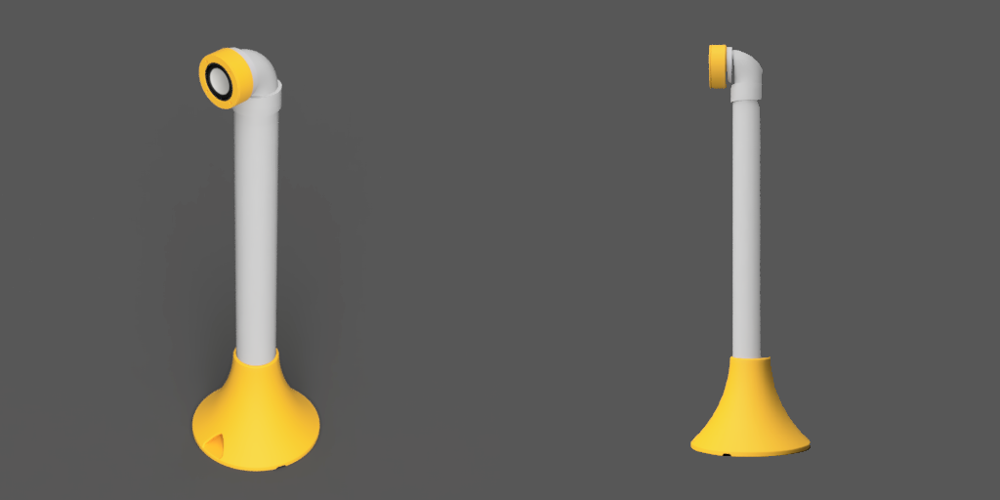

# 塩ビパイプとダイソー330円スピーカーでつくるバックロードホーン共鳴管

ホームセンターで売っている塩ビパイプとダイソーの330円スピーカーのユニットでタワー型のスピーカーを作りました。

安く作れるわりに、低音が自然な感じで出ます。

- パイプ呼び径: 50
- 構造: バックロードホーン
- 箱容積: 約1.3L
- スピーカーの高さ: 550mm（40mmカラー使用時）

スピーカーの高さはカラーの長さで調整できます。カラーなしでは510mmになります。

## 3Dデータ
|名称|数量|メモ|
|---|:---:|---|
|[ベース](step/VU50-stand-daiso330-base.step)|2|VUパイプを差し込む土台です|
|[バッフルケース](step/VU50-stand-daiso330-buffle-case.step)|2|スピーカーを固定するパーツです。エルボに差し込みます。|
|[バッフルプレート](step/VU50-stand-daiso330-buffle-plate.step)|2|スピーカーの前面カバーです。これとバッフルケースでスピーカーの金具を挟みます。|
|[40mmカラー](step/VU50-stand-daiso330-collar-L40.step)|2|ベースの中のパイプ穴に入れてスピーカーの高さを調整するパーツです。座高が低い人には不要かも。|

## 部品表

| # | 名称 | 数量 | 例 | メモ |
| ---: | --- |:---:| --- | --- |
| 1 | スピーカーユニット | 1 | [ダイソー ミニスピーカー](https://jp.daisonet.com/products/4549131578874) | バラして、スピーカーユニットだけ取り出します |
| 2 | VUパイプ 50x0.5m| 2 | [クボタケミックス 排水用塩ビパイプ ＶＵ ５０Ｘ０．５Ｍ](https://www.amazon.co.jp/gp/product/B08TGCDHS6) |  |
| 3 | エルボ 50| 2 | [クボタケミックス DV継手 エルボ DV-DL 50 DVDL50](https://www.amazon.co.jp/gp/product/B01N9XAYYG) |  |
| 4 | 端子台 | 2 | [2芯x2本ワンタッチコネクタ](https://www.amazon.co.jp/gp/product/B0C6FBPBZJ) |スピーカーケーブルの中継用|
| 5 | M3 L10 ねじ | 2 | [TRUSCO ナべ頭小ネジ 三価 白 全ネジ M3×10 214本入 B701-0310](https://www.amazon.co.jp/gp/product/B002A5MJ3O) |端子台をベースの内側に止めるのに使用|
| 6 | M3 L8 ねじ | 8 | [TRUSCO ナべ頭小ネジ 三価 白 全ネジ サイズM3×8 240本入 B7010308](https://www.amazon.co.jp/gp/product/B002A5MJXO) |スピーカーをバッフルプレートとバッフルケースに止めるために使用|
| 7 | M3 ワッシャ | 8 | [TRUSCO 平ワッシャー ステンレス サイズM3 490個入 B270003](https://www.amazon.co.jp/gp/product/B002A5NHYE) | スピーカーをバッフルプレートとバッフルケースに止めるために使用|
| 8 | 2芯ケーブル | 1 | [協和ハーモネット ビニル平形コード/スピーカーコード VFF 0.3SQ 10m 赤/ 黒](https://www.amazon.co.jp/dp/B01HARDAZC) | 0.3sq～0.75sq（AWG22～18）, 約80cm |
| 9 | コードフック | 2 | [コードフックS 粘着テープ式 16個入](https://jp.daisonet.com/products/4549131176919) | エルボの内側でスピーカーケーブルを止めるのに使用 |
| 10 | ホットボンド | 適宜 |[グルースティック ２０本入 乳白色](https://jp.daisonet.com/collections/handmade0211/products/4549131300857)| 底面のケーブル穴を塞ぐのに使用 |

## link

- [こたつサイドなタワースピーカー](../README.md)
