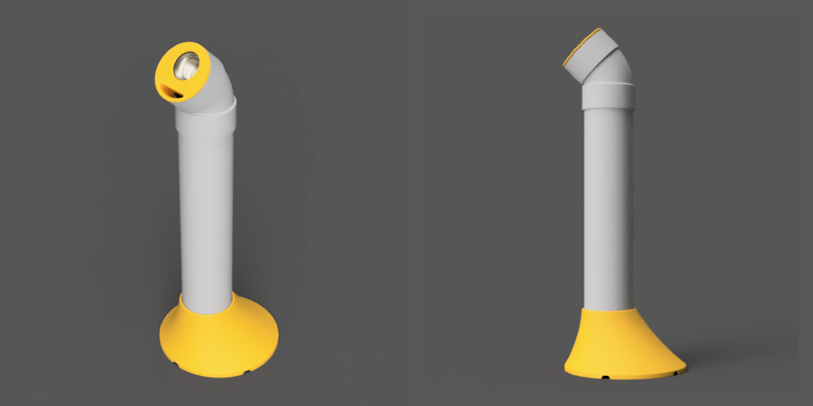

# 塩ビパイプとNFJの470円スピーカーでつくるバスレフ管

ホームセンターで売っている塩ビパイプとアマゾンで470円（送料別）で売っているNFJのスピーカーでタワー型のスピーカーを作りました。

ユニットが重いので、太いパイプを使いました。また、耳に近づけられるように偏芯した配置になっています。

箱容積が大きいせいか、余裕のあるバランスのいい音になりました。

- パイプ呼び径: 75
- 箱容積: 約2.7L
- 構造: バスレフ
- ポート面積: 約5cm²
- ダクト長: 4cm
- スピーカーの高さ: 575mm

スピーカーの高さは固定です。

## 3Dデータ
|名称|数量|メモ|
|---|:---:|---|
|[ベース](step/VU75-stand-nfj-470-base.step)|2|VUパイプを差し込む土台です|
|[バッフル](step/VU75-stand-nfj-470-buffle.step)|2|スピーカーを固定するパーツです。エルボに差し込みます。|
|[M3t2ワッシャ](step/VU75-stand-nfj-470-washer-m3-t2.step)|8|スピーカーをバッフルにネジ止めするのにネジが長すぎるので、このワッシャにネジを差し込んだ後にスピーカーを止めます。|

## 部品表

| # | 名称 | 数量 | 例 | メモ |
| ---: | --- |:---:| --- | --- |
| 1 | スピーカーユニット | 2 | [NFJ フルレンジスピーカーユニット2インチ(52mm) 4Ω/MAX20W \[スピーカー自作/DIYオーディオ\]/1個](https://www.amazon.co.jp/gp/product/B074MRC7DF)| エージングを50時間ほどしてやると、いい感じになりました。 |
| 2 | VUパイプ 75x0.5m| 2 | [クボタケミックス 排水用塩ビパイプ ＶＵ ７５Ｘ０．５Ｍ](https://www.amazon.co.jp/dp/B08TG9537P)|  |
| 3 | エルボ 75| 2 | [クボタケミックス 排水・通気・雨水立とい用 VU継手 VU-45L 75](https://www.amazon.co.jp/dp/B00I4KQWFK)|  |
| 4 | 端子台 | 2 | [2芯x2本ワンタッチコネクタ](https://www.amazon.co.jp/gp/product/B0C6FBPBZJ)|スピーカーケーブルの中継用|
| 5 | M3 L8 ねじ | 10 | [TRUSCO(トラスコ) ナべ頭小ネジ 三価 白 全ネジ サイズM3×8 240本入 B7010308](https://www.amazon.co.jp/gp/product/B002A5MJXO) | スピーカーをバッフルの内側に止めるのに使用 端子台をベースの内側に止めるのに使用 |
| 6 | 2芯ケーブル | 1 | [協和ハーモネット ビニル平形コード/スピーカーコード VFF 0.3SQ 10m 赤/ 黒](https://www.amazon.co.jp/dp/B01HARDAZC) | 0.3sq～0.75sq（AWG22～18）, 約80cm |
| 7 | コードフック | 2 | [コードフックS 粘着テープ式 16個入](https://jp.daisonet.com/products/4549131176919)|エルボの内側でスピーカーケーブルを止めるのに使用|
| 8 | ホットボンド | 適宜 |[グルースティック ２０本入 乳白色](https://jp.daisonet.com/collections/handmade0211/products/4549131300857)| 底面のケーブル穴を塞ぐのに使用 |

## link

- [こたつサイドなタワースピーカー](../README.md)
